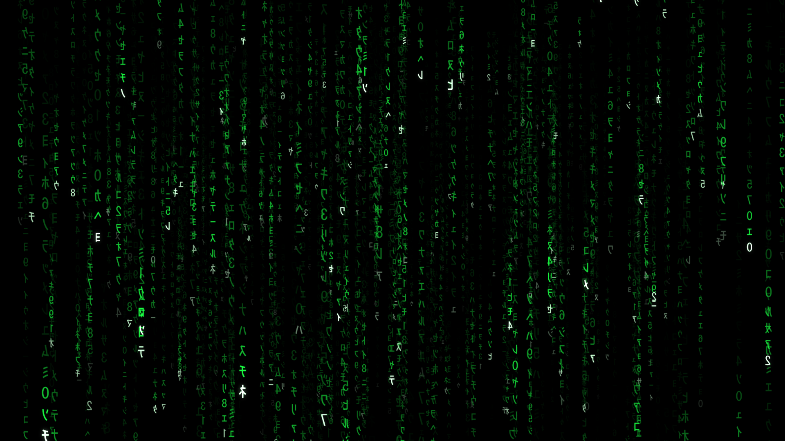
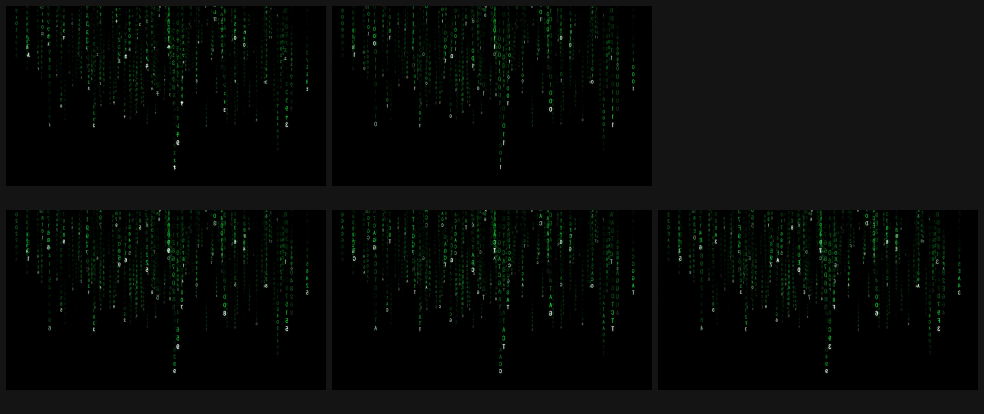
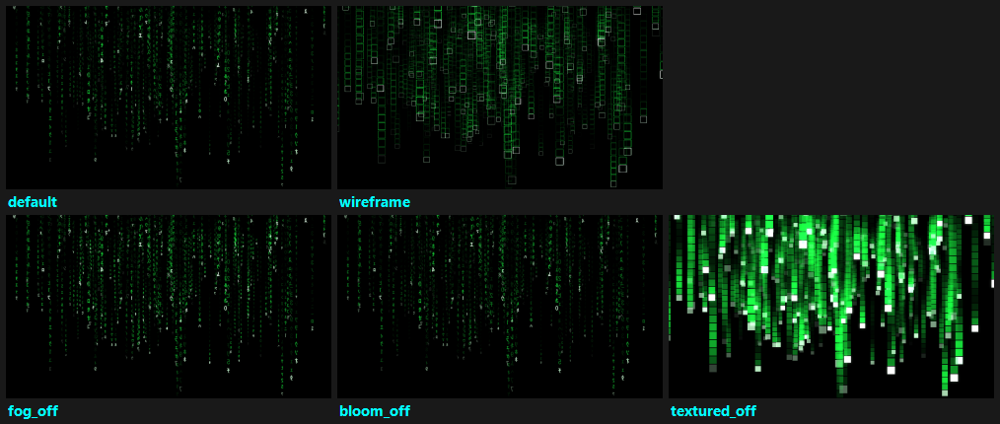

# Modern Matrix — Windows screensaver (`.scr`)

The Windows port of the macOS **Modern Matrix** 3D digital-rain screensaver — the
green katakana cascade from *The Matrix*, rebuilt natively for Windows.



It ships as a single self-contained **`ModernMatrix.scr`** (an x64 Win32 PE): a
**Direct3D 11** renderer, a **DirectWrite** glyph atlas, a native settings dialog with a
**live preview**, and the screensaver host shell. Everything fits in ~250 KB with the
shaders embedded — no loose files to install.

## One engine, two native renderers

The interesting part isn't the rain — it's that **macOS and Windows share the exact same
simulation**. The digital-rain logic, the settings model and its derived values, the six
glyph encodings, and the world constants all live in portable C99 at
[`../core/mmcore.c`](../core/mmcore.c). macOS compiles it and bridges it into Swift;
Windows compiles it and **links it** straight into the `.scr`.

So this port never re-implements the rain. It only provides the platform layer —
the D3D11 renderer, the DirectWrite atlas, the Win32 UI, and the host shell — and drives
the shared `mm_sim_*` API. Tweak the rain's behaviour once in `mmcore.c` and both
platforms pick it up. The HLSL shaders are a 1:1 port of the macOS Metal shaders
([`../Resources/Shaders.metal`](../Resources/Shaders.metal)), and the camera, fog, bloom,
and instance layout match field-for-field.

## Encodings & looks

All six glyph encodings (Matrix · Binary · Hexadecimal · Decimal · DNA · Unicode katakana):



Every visual toggle — wireframe outlines, untextured quads, fog, bloom, brightness waves:



## Features (1:1 parity with macOS)

| | |
| --- | --- |
| 3D falling rain, white-green leaders, fading trails, glyph mutation | ✅ |
| Density / speed, 6 encodings | ✅ |
| Fog, waves, camera panning | ✅ |
| Bloom (HDR bright-pass + separable Gaussian) + intensity | ✅ |
| Textured / wireframe modes | ✅ |
| FPS overlay (Direct2D/DirectWrite) | ✅ |
| HDR — FP16 scRGB swapchain on HDR displays, SDR otherwise | ✅ |
| Settings dialog with **live D3D preview**, persists to the registry | ✅ |
| `/s` full-screen · `/p` preview · `/c` configure · exits on input · multi-monitor | ✅ |

## Build

Requires **Visual Studio Build Tools 2022** (the "Desktop development with C++" workload:
MSVC + Windows SDK). The build driver locates the toolchain via `vswhere` and imports the
MSVC environment itself, so a plain PowerShell prompt is enough:

```powershell
.\build.ps1                 # build ModernMatrix.scr
.\build.ps1 -Test           # compile + run the mmcore link test
.\build.ps1 -Shot -Frames 1000   # render a headless PNG to build\shot.png
.\build.ps1 -Run            # build + launch full-screen (move mouse to exit)
.\build.ps1 -Configure      # build + open the settings dialog (with live preview)
.\build.ps1 -Clean
```

`build.ps1` embeds `shaders.hlsl` into the binary at compile time, so the resulting `.scr`
is fully self-contained.

## Install

```powershell
.\install.ps1               # current user, no admin — sets it as your active saver
.\uninstall.ps1             # restore your previous saver, remove the per-user copy
.\install-systemwide.ps1    # ELEVATED — copies to System32 so it appears in the
                            # "Screen Saver Settings" dropdown
```

You can also right-click `ModernMatrix.scr` → **Install** / **Test** / **Configure**, or
open the classic dialog with `control desk.cpl,,@screensaver`.

> Note: the Windows Screen Saver dropdown only lists `.scr` files in `System32`, so to make
> it selectable there you need the one-time elevated `install-systemwide.ps1`. The per-user
> `install.ps1` makes it your *active* saver without admin, but won't list it in the dropdown.

## Command-line (the `.scr` host contract)

| Arg | Meaning |
| --- | --- |
| `/s` | Run full-screen — one window + renderer per monitor; exits on input. |
| `/p <HWND>` | Preview inside the given parent window (the little box). |
| `/c[:<HWND>]` | Configure — the modal settings dialog with live preview. |
| `/w` | Dev: run in a normal resizable window (ESC to quit). |
| `/shot <png> [frames] [w] [h]` | Dev: headless render to a PNG (used for verification). |

That last one is handy for checking the look without launching the full-screen saver: a headless
mode that renders N frames offscreen and writes a PNG. Every screenshot in this README came
out of it.

## Settings

Persisted in the registry at `HKCU\Software\Chewie\ModernMatrix`. The dialog mirrors the
macOS settings: **density** and **speed** sliders, the **encoding** dropdown, and toggles for
**fog, waves, panning, textured, wireframe, show frame rate, bloom (+ intensity), HDR** —
with a live preview that updates as you change them. Defaults: density 0.42, speed 0.08
(slow drip), Matrix encoding, fog/waves/textured/bloom/hdr on, panning/wireframe/FPS off,
bloom intensity 0.53.

## Architecture (`windows/`)

| File | Role |
| --- | --- |
| `host.cpp` | `WinMain`, argv parsing, per-monitor windows, frame loop, exit-on-input. |
| `renderer.{h,cpp}` | D3D11 device/swapchain, instanced billboards, fog, bloom, FPS overlay, HDR, headless capture. |
| `shaders.hlsl` | Glyph + bloom shaders, ported 1:1 from `../Resources/Shaders.metal` (embedded at build time). |
| `atlas.{h,cpp}` | DirectWrite → single-channel R8 glyph atlas (mirrored, mipmapped). |
| `config.{h,cpp}` + `mm.rc` + `resource.h` | The native settings dialog + live preview. |
| `settings_store.{h,cpp}` | Registry load/save of `MMSettings`. |
| `log.{h,cpp}` | Logging to `%TEMP%\ModernMatrix.log`. |
| `build.ps1` | MSVC build driver; `install*.ps1` / `uninstall.ps1` deployment. |

Built against the shared engine in [`../core/`](../core/README.md). The original
porting blueprint is [`../PORTING.md`](../PORTING.md).
